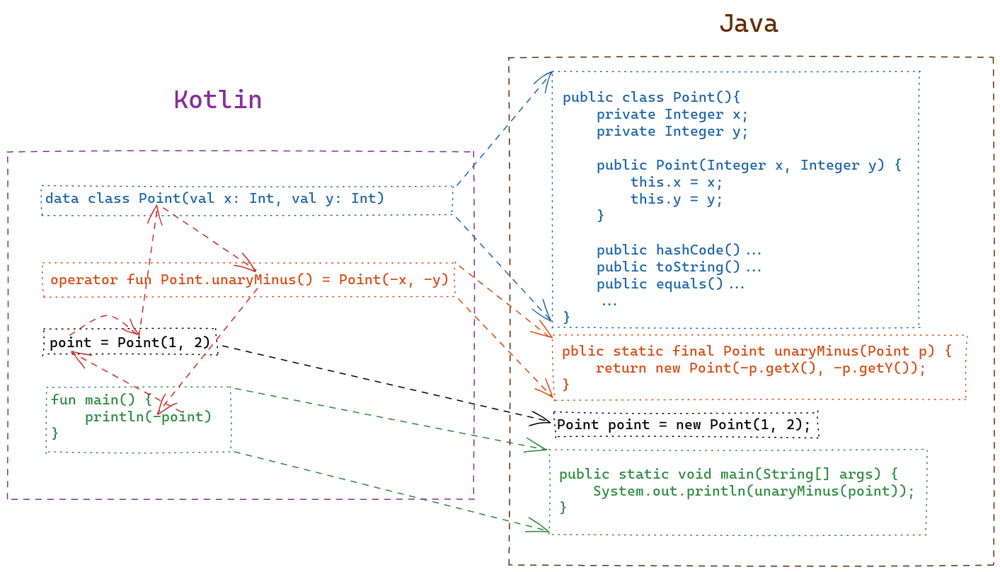

= Presentation Title
:date: 2021-06-19
:author: WangHeng @admin <admin@eastack.me>
:icons: font
:customcss: css/main.css
:source-highlighter: highlightjs
:revealjs_theme: simple
:highlightjs-languages: groovy
:highlightjs-theme: node_modules/highlightjs/styles/atom-one-light.css

== Slide Five

[.notes]
--
* note one
* note two
--

[.plain]
 

Uses highlighted code

[source, python]
----
print "Hello World"
----
